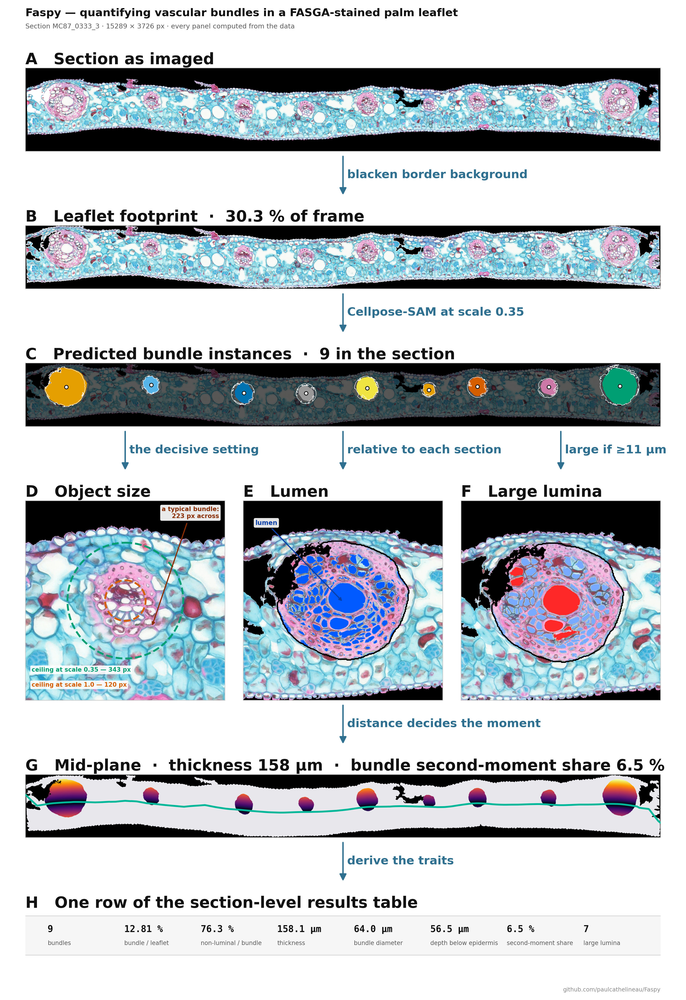
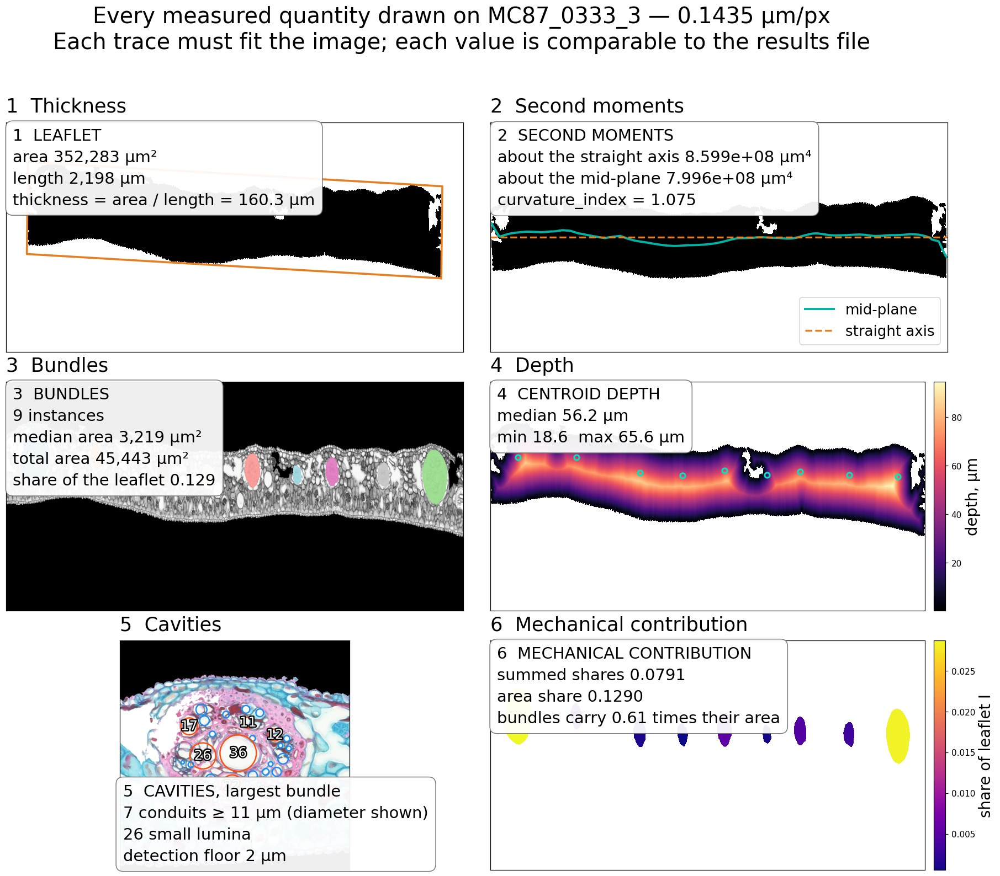
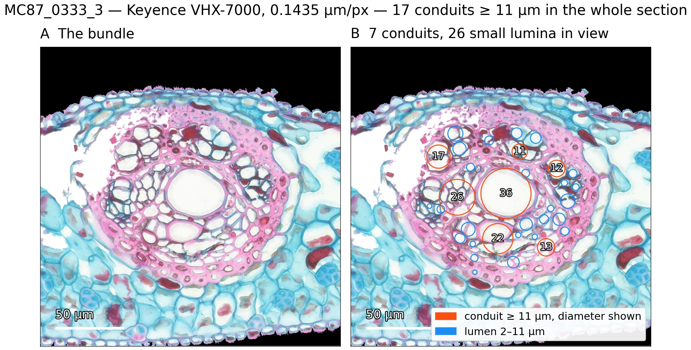

# Faspy

Automated quantification of vascular bundles in FASGA-stained transverse sections of palm leaflets.

Faspy segments vascular bundles as individual instances and derives anatomical traits describing bundle amount, lumen, position and spatial organisation. Large histological mosaics are processed end to end without manual intervention.



<sub>Every panel is generated from analysed data with `faspy figure`, so the visual output remains linked to the code and measurements.</sub>

## What Faspy measures

For each section, Faspy reports vascular-bundle number and area, lumen area, bundle position and spacing, leaflet thickness, and geometric traits including the second moment of area about the leaflet mid-plane. Visual overlays are generated so that measured quantities can be checked directly against the source image.



---

## Datasets

| Set | Sections | Use |
|---|---:|---|
| **Cross-validation set** | 151 | Hand-annotated sections used for five-fold model evaluation and the reported segmentation metrics. |
| **Production set** | 433 | Unannotated sections quantified with the final pipeline. |

---

## Main results

The instance model substantially outperformed the semantic baseline at the object level.

| Metric | U-Net (semantic) | Cellpose-SAM (instance) |
|---|---:|---:|
| **AP at IoU 0.5** | 0.429 | **0.876** |
| Object F1 | 0.60 | **0.934** |
| Counting error | 119 % | **6.9 %** |
| Bundle IoU | 0.673 | **0.816** |

Predicted bundle area had a mean signed bias of −4.5 % and a mean absolute relative error of 13.5 %. The remaining error was concentrated mainly among the largest bundles rather than being a uniform boundary offset.

AP follows the Cellpose definition, `TP / (TP + FP + FN)`, at a fixed IoU matching threshold.

### Why fine-tuning and scale matter

The published Cellpose-SAM checkpoint did not recover vascular bundles as complete objects. At acquisition resolution, bundles were much larger than the object sizes represented during pretraining. Fine-tuning was therefore required to define the vascular bundle as the target object, while rescaling brought bundle size into the effective operating range of the model.

Without fine-tuning, the checkpoint matched only one of 1,126 annotated bundles. At the Faspy working scale, the median bundle diameter is about 56 px and 89 % of annotated bundles fall within the approximate Cellpose-SAM pretraining range.

### Lumen measurement

Lumen is measured photometrically inside each predicted vascular bundle at acquisition resolution; it is not produced by a second neural network.

| Validation metric | Result |
|---|---:|
| Pixel-wise IoU against manually drawn masks | **0.852** |
| Precision / recall | **0.933 / 0.946** |
| Mean absolute area error against manual ImageJ measurements | **12.4 %** |
| Mean signed area bias | **−3.6 %** |

Detected lumen objects smaller than 2 µm in equivalent diameter are discarded. Objects ≥11 µm are reported as **large lumina**. This is an operational size class only: it does not identify xylem vessels or distinguish conductive from non-conductive lumina.



### Transfer across preparation and acquisition chains

Faspy was evaluated on sections produced by two preparation and acquisition chains (EcoFoG Canon–Olympus and AMAP Keyence). Bundle detection remained robust in both chains, although boundary agreement and colour distributions differed.

The red-to-blue index of non-luminal bundle pixels shifted markedly between chains (median 0.184 for EcoFoG and 0.025 for AMAP in the current comparison). Preparation and acquisition differed simultaneously, so this shift cannot be attributed to a single factor. Absolute colour values should therefore not be interpreted as directly comparable anatomical measurements between chains.

### Bundle composition and spatial organisation

At bundle level, Faspy distinguishes lumen from non-luminal bundle tissue and retains each bundle as an individual object. This allows analyses of bundle size, lumen fraction, depth, spacing and contribution to the leaflet second moment of area.

The ≥11 µm class remains a size descriptor of large lumina, not a vessel census. Likewise, non-luminal bundle area should not be interpreted as a specific tissue such as xylem, phloem or fibrous sheath without dedicated annotations.

---

## Installation

```bash
python -m pip install -e .
```

---

## Usage

```bash
faspy prepare                  # convert sources, build label maps and the manifest
faspy evaluate zeroshot        # published Cellpose-SAM checkpoint, no fine-tuning
faspy evaluate instances       # cross-validation and final instance model
faspy quantify                 # quantify the production sections
```

`faspy quantify` writes the section-level output table and retains per-bundle measurements. Derived quantities include the second moment of area about the leaflet mid-plane, bundle depth, nearest-neighbour spacing, lumen fraction and lumen-size classes.

Render figures directly from analysed data:

```bash
faspy figure pipeline GALB_0061_1                      # overview of the analysis pipeline
faspy figure pipeline GALB_0061_1 --model cpsam_final  # segmentation from the model
faspy figure traits   GALB_0061_1                      # anatomical traits on one section
faspy figure diameters                                 # bundle size vs pretraining range
```

Diagnostics do not train a model:

```bash
faspy diagnose images          # source files that will not decode
faspy diagnose annotations     # implausible annotation masks
faspy diagnose orphans         # predicted bundles with little reference overlap
faspy diagnose sweep           # decoding-threshold diagnostics
faspy diagnose lumen           # photometric lumen rule against manual measurements
```

`faspy <command> --help` lists available options. Default parameters are stored in `src/faspy/config.py`.

### Expected dataset layout

```text
$FASGA_ROOT/
├── IMG_LM/          <key>_LM.png   FASGA-stained leaflet on black   (model input)
├── IMG_BU/          <key>_BU.png   bundle annotation on black       (reference mask)
├── DIC/             second histological set, ImageJ export conventions
└── LU+VA+BULU/      fully annotated reference sections
```

`faspy prepare` derives `seg_work/` and `manifest.csv`; source images are not modified.

---

## How it works

**Preparation.** Each annotated section is converted to a three-class label map (background, leaflet and vascular bundle) at half acquisition resolution. The leaflet footprint is derived from the stained image itself. Border-connected background is removed while enclosed intercellular spaces are retained.

**Instance segmentation.** Bundle instances are the connected components of the manual bundle masks, so no separate instance annotation was required. Cellpose-SAM is fine-tuned on these objects and predicts one mask per vascular bundle.

**Semantic baseline.** A four-level U-Net is trained from scratch on the same three classes and used only as a semantic comparison. It is not used in production.

**Quantification.** The leaflet mask is derived photometrically, vascular bundles come from the instance model, and lumen is detected inside each bundle from the minimum of the three colour channels after section-wise intensity normalisation. Geometric traits are calculated from the leaflet mid-plane and the predicted bundle instances.

Further methodological details, including the two acquisition chains, spatial scaling, mask correction, colour normalisation and evaluation metrics, are documented in **[docs/METHODS.md](docs/METHODS.md)**.

---

## Compute cost

Measured on one NVIDIA RTX 3050 GPU with 8 GB memory:

| Task | Time |
|---|---:|
| Full five-fold cross-validation | ~88 h |
| **Quantification of 433 production sections** | **57 min** |
| Checkpoint size | 1.22 GB |

Predicted instance maps are saved to `Out/masks/`, so downstream trait calculations do not require repeating model inference.

---

## Code availability

Faspy is released under the MIT licence. The development repository is hosted on GitHub:

<https://github.com/paulcathelineau/Faspy>

The image dataset should be cited separately through its own archive and DOI:

**Image dataset:** 10.5281/zenodo.22233928

Software and data have separate licences: the code is released under MIT, while the image dataset is archived separately under CC BY 4.0.

---

## References

Stringer, C., Wang, T., Michaelos, M. & Pachitariu, M. (2021). Cellpose: a generalist algorithm for cellular segmentation. *Nature Methods* **18**, 100–106. https://doi.org/10.1038/s41592-020-01018-x

Pachitariu, M. & Stringer, C. (2022). Cellpose 2.0: how to train your own model. *Nature Methods* **19**, 1634–1641. https://doi.org/10.1038/s41592-022-01663-4

Stringer, C. & Pachitariu, M. (2025). Cellpose3: one-click image restoration for improved cellular segmentation. *Nature Methods*. https://doi.org/10.1038/s41592-025-02595-5

Pachitariu, M., Rariden, M. & Stringer, C. (2025). Cellpose-SAM: superhuman generalization for cellular segmentation. *bioRxiv*. https://doi.org/10.1101/2025.04.28.651001

Ronneberger, O., Fischer, P. & Brox, T. (2015). U-Net: convolutional networks for biomedical image segmentation. *MICCAI*. https://doi.org/10.1007/978-3-319-24574-4_28

Kirillov, A. *et al.* (2023). Segment Anything. *ICCV*. https://doi.org/10.1109/ICCV51070.2023.00371
