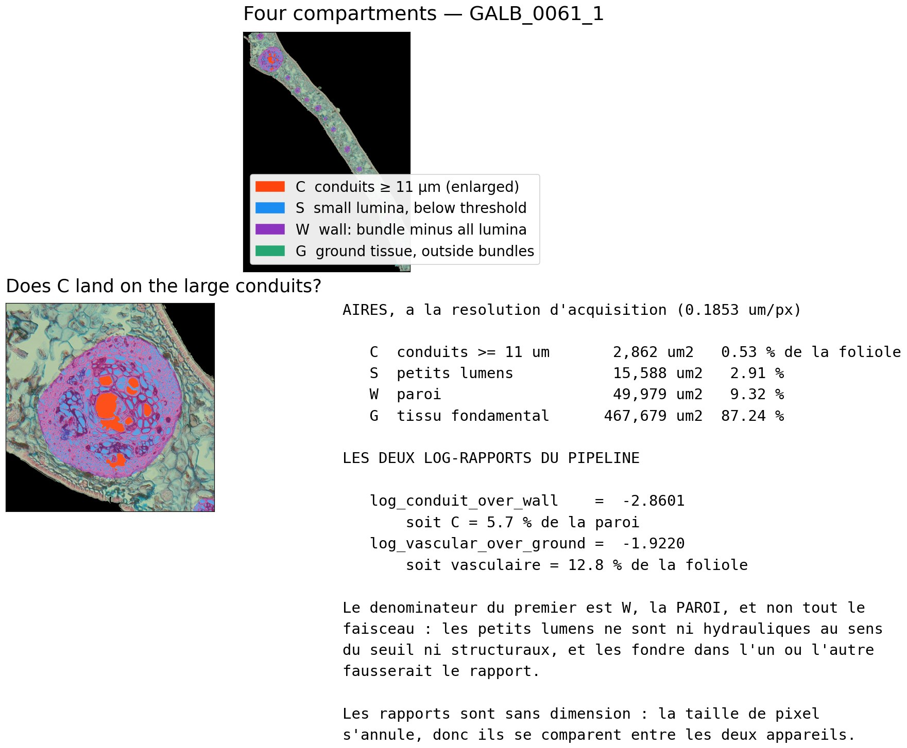

# Faspy

Automated quantification of vascular bundles in FASGA-stained transverse
sections of palm leaflets.

For each section the pipeline reports the **number of vascular bundles**, their
**area as a fraction of the leaflet**, the **lumen area**, and 32 derived traits
describing where the tissue sits rather than only how much of it there is.
Sections are large — a median of 7512 × 9048 px, up to 13724 × 14416 — and are
processed end to end without manual intervention.


<sub>Every panel is computed from the data by `faspy figure`, so the figure
cannot drift from the code. Regenerate it for any section with
`faspy figure pipeline <key> --model cpsam_final`.</sub>

### What each quantity actually means

Numbers in a results table are hard to audit. Every measurement is therefore
also drawn on the section it came from, with its value beside it, so that a
wrong trace is visible without reading any code.


This is how the two defects described below were found: a mid-plane that ran
outside the tissue, and a mask whose internal fragments were being counted as
separate bundles. Both executed without error and produced plausible-looking
numbers.

---

## The three section sets

These are not interchangeable, and every figure below states which one it refers
to.

| Set | Sections | What it is |
|---|---|---|
| **Cross-validation** | 151 | Hand-annotated, after removing one section with no leaflet image and one whose mask covered the whole leaflet. Every model metric refers to these. |
| **Admissible** | 148 | The above, less three sections found afterwards to have bundles that are plainly visible but were never drawn. |
| **Production** | 433 | Every leaflet section held, less one whose image file was truncated. None is annotated. |

---

## Results

Five-fold cross-validation stratified by **site**. Sections were assigned to
folds by key rather than by palm; only one individual contributes two sections,
and those two fell into different folds, so one validation section shared a palm
with the training set. The splitter has since been corrected to group whole
palms, and the assignment that produced these figures is archived so that they
remain reproducible.

| Metric | U-Net (semantic) | Cellpose-SAM (instance) |
|---|---|---|
| **AP at IoU 0.5** | 0.429 | **0.876** |
| Object F1 | 0.60 | **0.934** |
| Count error | +119 % | **6.9 %** |
| Area error, uncalibrated | — | **13.5 %** |
| Area error, after global calibration | 49 % | 16.3 % |
| Bundle IoU | 0.673 | **0.816** |

AP is defined as the Cellpose papers define it, `TP / (TP + FP + FN)` at a fixed
IoU, not the COCO area-under-the-curve quantity. It is a deterministic transform
of the F1 below it, `AP = F1 / (2 - F1)`.

**Excluding the three incompletely annotated sections raises AP to 0.907 and
drops the counting error to 4.4 %.** True positives are identical, 1063 in both
cases; false positives fall from 88 to 62 and false negatives from 63 to 47.
Three sections therefore carried 26 of the false positives and 16 of the false
negatives. Those sections were in the training folds as well as the test folds,
so the net direction of their effect cannot be established without retraining.

**Without fine-tuning**, the published Cellpose-SAM checkpoint matches a single
bundle out of 1126 on these sections, an AP of 2 × 10⁻⁴. The objects it returns
have a median area of 5.2 % of a bundle and lie inside one: it segments the
cells it was trained on. Rescaling alone raises AP to 0.012 without making the
model usable. Fine-tuning and rescaling are both necessary and act in sequence.

### Lumen

Measured photometrically at acquisition resolution, not learnt.

| | |
|---|---|
| Pixel-wise IoU against manually drawn masks | **0.852** (19 sections) |
| Precision / recall | 0.933 / 0.946 |
| Area error against manual ImageJ measurements | **12.4 %** (16 sections) |
| Area bias | −3.6 % |

Measuring on the acquisition-resolution image rather than at the working scale
is what produces this agreement: on the same 21 masks and at the same threshold,
the working scale gives 0.811 and the acquisition resolution 0.848. The gain is
one of resolution, not of sample selection. It does not extend to lumen *area*,
whose error is unchanged — the rule already recovered the right quantity at the
coarser scale, but placed it less precisely.

Every detected cavity is circled, and those reaching the conduit threshold carry
their equivalent diameter, so what is counted and what is not can be checked
against the anatomy rather than taken on trust.


The threshold of 11 µm separates large conduits from the rest. It does **not**
separate vessels from fibres, and it measures xylem only: a metaxylem vessel is
dead at maturity, so its lumen is an empty cavity a photometric rule can find,
whereas a phloem sieve tube is alive and full of cytoplasm and never appears as
one. Phloem therefore falls into the non-luminal compartment, which it inflates.
The count is reported as ordinal, not as a vessel census.

### Composition

At leaflet scale the section has four compartments — conduits, small lumina,
wall, and ground tissue — and two log-ratios describe it completely.



Log-ratios rather than fractions, because fractions are constrained by their
sum: raising one forces another down, so correlating two shares of the same
whole partly measures that constraint rather than the plant. Both ratios are
dimensionless, so pixel size cancels and the two acquisition chains compare
directly.

---

## Installation

```bash
python -m pip install -e .
```

---

## Usage

```bash
faspy prepare                  # convert sources, build label maps and the manifest
faspy evaluate zeroshot        # the published checkpoint, no fine-tuning: the baseline
faspy evaluate instances       # 5-fold cross-validation, then the final model
faspy quantify                 # per-section measurements for every production section
```

`faspy quantify` writes 42 columns per section, of which 32 are derived traits.
Beyond the areas it reports where the tissue sits: the second moment of area
about the leaflet mid-plane, depth beneath the epidermis, spacing between
neighbours, and the lumen resolved into objects so that large conduits can be
told from small lumina. That separation is one of size, not of identity: it does
not distinguish vessels from fibres, and it sees xylem only. The geometric contribution to bending depends on the
second moment of area, in which an element contributes as the **square** of its
distance from the neutral axis.

Render any figure, every panel computed from the data:

```bash
faspy figure pipeline GALB_0061_1                      # panels from the annotation
faspy figure pipeline GALB_0061_1 --model cpsam_final  # segmentation from the model
faspy figure traits   GALB_0061_1                      # what every trait measures
faspy figure diameters                                 # bundle size vs pretraining range
```

Diagnostics, none of which train anything:

```bash
faspy diagnose images          # source files that will not decode
faspy diagnose annotations     # masks that are implausible against their own section
faspy diagnose orphans         # detected bundles that no annotation covers
faspy diagnose sweep           # decoding thresholds, on one fold, no retraining
faspy diagnose lumen           # the photometric rule against manual measurements
```

`faspy <command> --help` lists the options. Every default comes from
`src/faspy/config.py`, the only place any path or threshold is defined.

### Expected dataset layout

```
$FASGA_ROOT/
├── IMG_LM/          <key>_LM.png   FASGA-stained leaflet on black   (model input)
├── IMG_BU/          <key>_BU.png   bundle annotation on black       (ground truth)
├── DIC/             second histological set, ImageJ export conventions
└── LU+VA+BULU/      fully annotated reference sections
```

`faspy prepare` derives `seg_work/` and `manifest.csv` from these; nothing else
reads the sources directly.

---

## How it works

**Preparation.** Each annotated section becomes a three-class label map
(background, leaflet, bundle) at half resolution, plus the matching input image.
The leaflet footprint comes from the stained image itself, so a bundle can never
be labelled outside the section. Stray white background touching an image border
is blackened; white fully enclosed by tissue is a genuine air space and is kept.

**Instance route.** Bundle instances are the connected components of the bundle
annotation, so no separate instance labelling was needed. Cellpose-SAM is
fine-tuned on those, and each predicted object is one bundle: counting is native
and touching bundles separate without a watershed rule.

**Semantic route.** A four-level U-Net trained from scratch over the same three
classes, kept as the semantic comparison in the table above. **It is not used in
production.** The leaflet outline there comes from a deterministic photometric
threshold on the stained image itself, which is what `faspy quantify` runs and
what the manual-measurement validation tests.

**Quantification.** The leaflet comes from the image, the bundles from the
instance model, and the lumen from a photometric test inside each detected
bundle: a cavity stays bright in every channel, so the test is on the minimum of
the three, not on luminance.


Why each of these choices was made, with the measurements behind it — the two acquisition chains, the mask cleaning, the scale mismatch, what colour can and cannot do, and how to read the accuracy figures — is set out in **[docs/METHODS.md](docs/METHODS.md)**.
## Compute cost

Measured on one RTX 3050, 8 GB:

| | |
|---|---|
| One fold, 100 epochs, ~120 sections | ~17 h 40 |
| Full five-fold cross-validation | ~88 h |
| Final model, 151 sections | ~22 h |
| **Production, 433 sections** | **57 min** |
| Checkpoint size | 1.22 GB |

Cellpose-SAM prints nothing during its epochs, so a run looks stalled while it
is working — check GPU utilisation instead. Settle a configuration on one fold
before committing to cross-validation.

On CPU the same production pass takes about 1 h 31 **per section**, some 650 h
for the set, so a GPU is not a convenience here. Predicted instance maps are
therefore written to `Out/masks/`: every later question about the same sections
is answered from them without repeating the inference.

---

## References

Stringer, C., Wang, T., Michaelos, M. & Pachitariu, M. (2021).
Cellpose: a generalist algorithm for cellular segmentation.
*Nature Methods* **18**, 100–106. https://doi.org/10.1038/s41592-020-01018-x

Pachitariu, M. & Stringer, C. (2022). Cellpose 2.0: how to train your own model.
*Nature Methods* **19**, 1634–1641. https://doi.org/10.1038/s41592-022-01663-4

Stringer, C. & Pachitariu, M. (2025). Cellpose3: one-click image restoration for
improved cellular segmentation. *Nature Methods*.
https://doi.org/10.1038/s41592-025-02595-5

Pachitariu, M., Rariden, M. & Stringer, C. (2025). Cellpose-SAM: superhuman
generalization for cellular segmentation. *bioRxiv*.
https://doi.org/10.1101/2025.04.28.651001

Ronneberger, O., Fischer, P. & Brox, T. (2015). U-Net: convolutional networks
for biomedical image segmentation. *MICCAI*.
https://doi.org/10.1007/978-3-319-24574-4_28

Kirillov, A. *et al.* (2023). Segment Anything. *ICCV*.
https://doi.org/10.1109/ICCV51070.2023.00371

Software is cited at the version used; see `requirements.txt`.

## Data

The image set is archived separately; see `CITATION.cff` for the deposit and its
DOI. The code in this repository reads it through `FASGA_ROOT` and never
modifies the source files.

## Licence

The code is released under the MIT licence; see `LICENCE`.

The image set is released separately under CC-BY-4.0 through its archive.
Software and data carry different licences deliberately: Creative Commons
licences grant no patent rights and are not intended for source code, while an
OSI-approved software licence is not suited to a collection of images.
