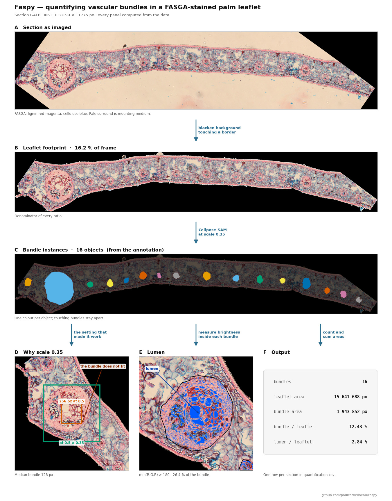

# Faspy

Automated quantification of vascular bundles in FASGA-stained transverse
sections of palm leaflets.

For each section the pipeline reports the **number of vascular bundles**, the
**bundle area as a fraction of the leaflet**, and the **lumen area as a fraction
of the leaflet**. Sections are large, roughly 8000 × 12000 px, and are processed
end to end without manual intervention.



<sub>Every panel above is computed from the data by `faspy figure`, so the figure
cannot drift from the code. Regenerate it for any section with
`faspy figure pipeline <key> --model cpsam_final`.</sub>

---

## Results

Five-fold cross-validation, stratified by individual, on 151 annotated sections.

| Metric | U-Net (semantic) | Cellpose-SAM (instance) |
|---|---|---|
| **AP at IoU 0.5** | 0.429 | **0.876** |
| Object F1 | 0.60 | **0.934** |
| Count error | +119 % | **6.9 %** |
| Area error, uncalibrated | — | **13.5 %** |
| Area error, after global calibration | 49 % | 16.3 % |
| Bundle IoU | 0.673 | **0.816** |

AP is reported as the Cellpose papers define it, `TP / (TP + FP + FN)` at a fixed
IoU threshold, rather than the COCO area-under-the-curve quantity. It is a
deterministic transform of the F1 on the line below, `AP = F1 / (2 - F1)`, and is
given because it is what the instance segmentation literature quotes. For
reference, fine-tuned Cellpose-SAM reaches AP@0.5 of about 0.82 on BlastoSPIM and
0.64 on the PlantSeg lateral root dataset.

A zero-shot baseline — the published checkpoint with no fine-tuning — is not yet
measured on this dataset. Until it is, the contribution of fine-tuning as
opposed to rescaling alone cannot be separated. Run `faspy evaluate zeroshot`
at 1.0 and at 0.35 to close that gap.

The instance route is the one used in production. It meets the 10 % target set
for counting; area does not yet, and the residual error is concentrated in the
largest size quartile (recall 0.87 there against ≥ 0.95 elsewhere, carrying 15 %
of the total missed area).

The leaflet class itself is segmented almost perfectly by the U-Net
(IoU 0.927), which is why that route is kept: it defines the denominator of
every ratio.

---

## Installation

```bash
python -m pip install -e .
```

For GPU training, install a CUDA build of PyTorch first:

```bash
python -m pip install torch --index-url https://download.pytorch.org/whl/cu121
```

Point the package at the dataset:

```bash
export FASGA_ROOT=/path/to/dataset      # Windows: $env:FASGA_ROOT = "..."
```

Without that variable the package assumes the dataset sits in the directory
containing this repository, alongside `IMG_LM/` and `IMG_BU/`.

---

## Usage

```bash
faspy prepare                  # convert sources, build label maps and the manifest
faspy evaluate zeroshot        # the published checkpoint, no fine-tuning: the baseline
faspy evaluate instances       # 5-fold cross-validation, then the final model
faspy quantify                 # per-section measurements for every section
```

Render the pipeline figure for any section, every panel computed from the data:

```bash
faspy figure pipeline GALB_0061_1                      # panels from the annotation
faspy figure pipeline GALB_0061_1 --model cpsam_final  # segmentation from the model
faspy figure traits   GALB_0061_1                      # what every trait measures
faspy figure diameters                                 # bundle size vs pretraining range
```

`faspy quantify` writes 35 columns per section. Beyond the areas, it reports
where the tissue sits: the second moment of area about the leaflet mid-plane,
depth beneath the epidermis, spacing between neighbours, and the lumen resolved
into objects so that metaxylem vessels can be told from fibre lumina. Flexural
stiffness follows position, not amount, because a element contributes as the
SQUARE of its distance from the neutral axis.

The mid-plane is taken column by column as the midpoint between the two faces,
so it follows the section and reports depth alone. Curvature measured against a
single straight axis is not a plant trait here: species accounts for 3 % of its
variance and site for 2 %, the rest lying between sections of one species at one
site. It records how the section came to rest on the slide. Analyses should
therefore rest on `I_bundle_share_flat` rather than `I_bundle_share`.

Diagnostics, none of which train anything:

```bash
faspy diagnose images          # source files that will not decode
faspy diagnose annotations     # masks that are implausible against their own section
faspy diagnose orphans         # detected bundles that no annotation covers
faspy diagnose sweep           # decoding thresholds, on one fold, no retraining
faspy diagnose depth           # calibrate a trichome filter on annotated bundles
```

`faspy <command> --help` lists the options. Every default comes from
`src/faspy/config.py`, which is the only place any path or threshold is defined.

### Expected dataset layout

```
$FASGA_ROOT/
├── IMG_LM/          <key>_LM.png   FASGA-stained leaflet on black   (model input)
├── IMG_BU/          <key>_BU.png   bundle annotation on black       (ground truth)
├── DIC/             second histological set, ImageJ export conventions
└── LU+VA+BULU/      fully annotated reference sections
```

`faspy prepare` derives `seg_work/` and `manifest.csv` from these; nothing else
reads the sources directly.

---

## How it works

**Preparation.** Each annotated section becomes a three-class label map
(background, leaflet, bundle) at half resolution, plus the matching input image.
The leaflet footprint comes from the stained image itself, so a bundle can never
be labelled outside the section. Stray white background touching an image border
is blackened; white fully enclosed by tissue is a genuine air space and is kept.

**Instance route.** Bundle instances are the connected components of the bundle
annotation, so no separate instance labelling was needed. Cellpose-SAM is
fine-tuned on those, and each predicted object is one bundle: counting is native
and touching bundles separate without a watershed rule.

**Semantic route.** A four-level U-Net trained from scratch over the same three
classes. It defines the leaflet area. It is not used to quantify bundles.

**Quantification.** The leaflet comes from the image, the bundles from the
instance model, and the lumen from a photometric test inside each detected
bundle: a cavity stays bright in every channel, so the test is on the minimum of
the three, not on luminance.

### What Cellpose does, and where it comes from

Cellpose is a generalist instance-segmentation method for microscopy, developed
by Stringer, Pachitariu and colleagues and released as open source. Four
versions matter here:

| Version | Contribution |
|---|---|
| Cellpose (2021) | the flow representation, trained on ~70 000 segmented objects |
| Cellpose 2.0 (2022) | fine-tuning and human-in-the-loop; a custom model from 500–1000 objects |
| Cellpose3 (2025) | image restoration for noisy, blurred or undersampled inputs |
| Cellpose-SAM (2025) | a Segment Anything transformer backbone; the version used here |

**The mechanism.** Most segmentation networks label each pixel as object or
background and then have to cut the result apart. Cellpose does not. Each
annotated object is first turned into a *flow field* by simulated diffusion from
its centre, so every pixel carries a vector pointing towards the centre of the
object it belongs to. The network learns to predict those two vector components
plus a probability that the pixel lies inside any object at all. At inference
the flows are followed downhill: pixels that converge on the same attractor form
one object.

That is why the method suits vascular bundles. Objects are recovered as whole
entities rather than reconstructed from a binary mask, so **counting is native**,
**touching bundles do not merge**, and an outline may be as irregular as it likes
— no convexity, no bounding box, no watershed rule to tune. It is also why the
semantic route plateaued at +119 % counting error: pixel-wise labelling has no
notion of an object, so two adjacent bundles are one connected component and
nothing downstream can separate them reliably.

**What is fine-tuned here.** Not a model trained from scratch. Training starts
from the published Cellpose-SAM checkpoint and adapts it to FASGA-stained
bundles at a low learning rate (1e-5) for 100 epochs. Instance labels are the
connected components of the existing bundle masks, so no new annotation was
produced for this project.

**The two decoding thresholds**, which act at inference and need no retraining:

- `cellprob_threshold` (default 0.0) thresholds the inside-object probability.
  Lowering it grows the masks and admits more objects.
- `flow_threshold` (default 0.4) is the tolerated mismatch between the predicted
  flows and the flows recomputed from the resulting mask. Raising it keeps
  objects with more irregular shapes.

`faspy diagnose sweep` scores combinations of the two on held-out sections.

**Why rescaling is needed at all.** Cellpose-SAM is reported as robust to object
size, which is true within the range it was pretrained on: images were resized
by a log-uniform factor of 0.25–4 around a 30 px mean diameter and cropped to
256 × 256, giving object diameters of roughly **7.5–120 px**. At the working
scale alone the bundles here have a median diameter of 168 px and a 90th
percentile of 377 px — outside that range, and beyond the 256 px crop for the
largest. Reducing by 0.35 brings the median to 56 px, inside the range the model
knows. The published fine-tuning protocol does the same thing, rescaling images
by the mean diameter of the training objects.

### Scale is the critical parameter

Cellpose-SAM trains on fixed 256 px crops and that window cannot be changed. At
the working scale the median bundle diameter is 168 px, so the largest bundles
do not fit and are never learnt: recall on the top quartile was 0.46, and 63 % of
all missed area sat in that quartile alone.

Reducing the scale at inference only *moves* the window — large bundles are
gained, small ones lost. Training *and* evaluating at 0.35 brings the median
diameter to 56 px and widens the usable range instead: recall went from
0.75 / 0.46 (smallest / largest quartile) to 0.98 / 0.87, area bias from −42.8 %
to −5.8 %, and count error from 15.1 % to 6.0 %.

`CELLPOSE_RESCALE` therefore multiplies `WORKING_SCALE`; the effective scale is
0.175 of the original. Training and inference must always use the same value.


Measured over the 1126 annotated bundles: at full resolution 1 % of them fall
inside the range the model knows, at the working scale 26 %, and at 0.175
**89 %**. Regenerate with `faspy figure diameters`.

---

## Design decisions

**Three classes, not five.** Vascular tissue was dropped: it is not separable by
colour in FASGA (IoU ≈ 0.08) and one individual carries no such annotation at
all. Lumen was dropped as a learnt class because it only ever worked on the DIC
subset; it is measured photometrically instead.

**No hue jitter.** In FASGA the colour *is* the signal — red-magenta marks
lignin, blue marks cellulose — so perturbing hue destroys the biology. Only
flips and right-angle rotations are used.

**No pretrained encoder.** An ImageNet-pretrained ResNet encoder was evaluated
and regressed (bundle IoU 0.67 → 0.57). The domain gap to stained microscopy
outweighs the transfer.

**Instance segmentation rather than semantic.** Pixel-wise labelling plateaued
at +119 % count error: it merges touching bundles and paints large false patches
in the mesophyll that no area filter can remove. That is a limit of the
formulation, not of the training.

**Minimum bundle area is defined at full resolution** (`MIN_BUNDLE_AREA_FULLRES`)
and converted, so it keeps its physical meaning when the working scale changes.

**Duplicate sections are removed when the manifest is built.** The DIC set
covers the same individuals as the native set, and an earlier converter appended
a `_v2` suffix on a name collision rather than skipping, producing byte-identical
twins. Because folds are drawn by key, one twin could train while the other
validated. Every cross-validated figure produced before this was found is
optimistic; the manifest builder now compares file contents and drops the twins.

---

## Interpreting the metrics

Pixel IoU is reported but is not the criterion. For small objects with a diffuse
border it barely moves while counting and area move a great deal.

Three figures should be read together, and in this order. The mean **signed**
area error is −4.5 %, so at the scale of the dataset the total area is very
nearly right. The mean **absolute** error is 13.5 %, so a single section is
typically out by far more than that mean suggests: what remains is variation
between sections, not a common offset. Applying the aggregate calibration factor
of 1.121 raises the mean absolute error to **16.3 %** — it makes matters worse,
because the factor is estimated from summed areas and is therefore set by the
largest sections while being applied to every one.

That calibration degrades the error is the clearest evidence that the residual
is spread rather than bias, and it is the reason the uncalibrated 13.5 % is the
figure to carry forward. The factor is also estimated on the same predictions it
is then evaluated against, which makes it flattering rather than pessimistic —
so the degradation is, if anything, understated.

The count bias is positive (+2.4 %), and 3.7–5.1 % of predictions overlap no
annotation. Visual arbitration by a plant anatomist found 11 of 13 such objects
to be real bundles the annotation had missed, and 2 to be trichomes. Part of the
reported count error is therefore a property of the reference rather than of the
model. `faspy diagnose orphans` re-runs that audit across the whole set.

---

## Compute cost

Measured on one RTX 3050, 8 GB:

| | |
|---|---|
| One fold, 100 epochs, ~120 sections | ~17 h 40 |
| Full five-fold cross-validation | ~88 h |
| Final model, 151 sections | ~22 h |
| Checkpoint size | 1.22 GB |

Cellpose-SAM prints nothing during its epochs, so a run looks stalled while it
is working; check GPU utilisation instead. A full experiment costs close to four
days, so settle a configuration on a single fold before committing to
cross-validation.

---

## References

Stringer, C., Wang, T., Michaelos, M. & Pachitariu, M. (2021).
Cellpose: a generalist algorithm for cellular segmentation.
*Nature Methods* **18**, 100–106. https://doi.org/10.1038/s41592-020-01018-x

Pachitariu, M. & Stringer, C. (2022). Cellpose 2.0: how to train your own model.
*Nature Methods* **19**, 1634–1641. https://doi.org/10.1038/s41592-022-01663-4

Stringer, C. & Pachitariu, M. (2025). Cellpose3: one-click image restoration for
improved cellular segmentation. *Nature Methods*.
https://doi.org/10.1038/s41592-025-02595-5

Pachitariu, M., Rariden, M. & Stringer, C. (2025). Cellpose-SAM: superhuman
generalization for cellular segmentation. *bioRxiv*.
https://doi.org/10.1101/2025.04.28.651001

Ronneberger, O., Fischer, P. & Brox, T. (2015). U-Net: convolutional networks
for biomedical image segmentation. *MICCAI*.
https://doi.org/10.1007/978-3-319-24574-4_28

Kirillov, A. *et al.* (2023). Segment Anything. *ICCV*.
https://doi.org/10.1109/ICCV51070.2023.00371

Software is cited at the version used; see `requirements.txt`.

## Data

The image set is archived separately; see `CITATION.cff` for the deposit and its
DOI. The code in this repository reads it through `FASGA_ROOT` and never
modifies the source files.

## Licence

The code is released under the MIT licence; see `LICENCE`.

The image set is released separately under CC-BY-4.0 through its archive.
Software and data carry different licences deliberately: Creative Commons
licences grant no patent rights and are not intended for source code, while an
OSI-approved software licence is not suited to a collection of images.
