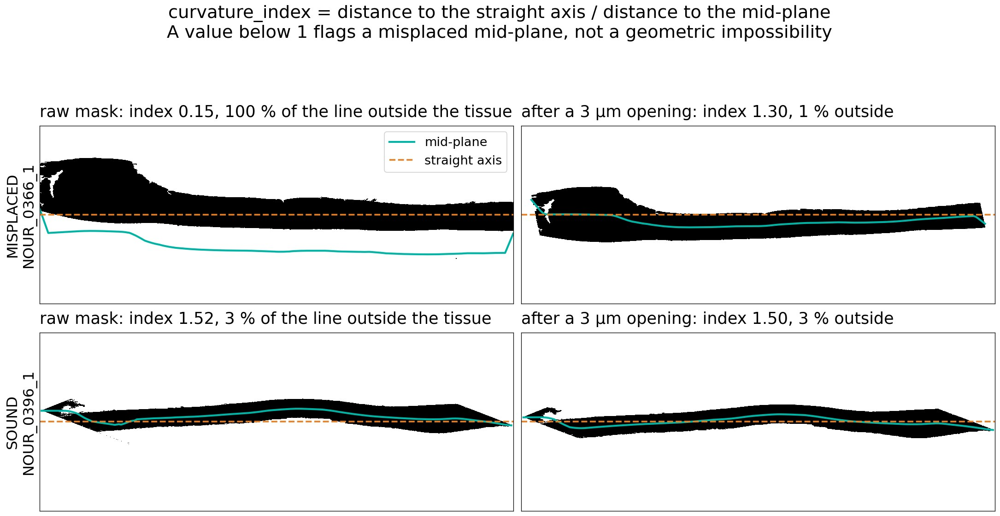
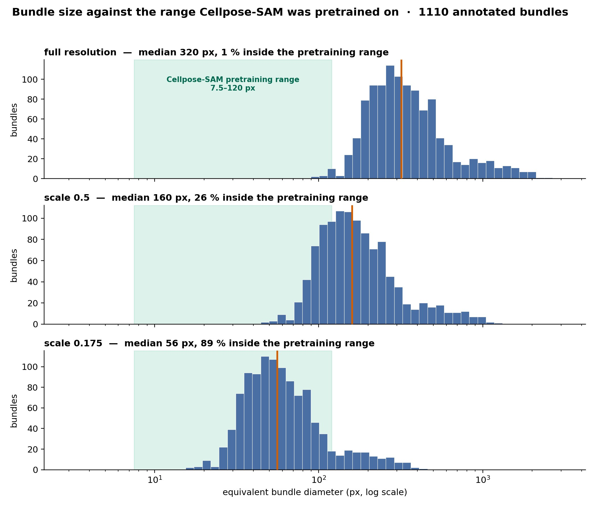
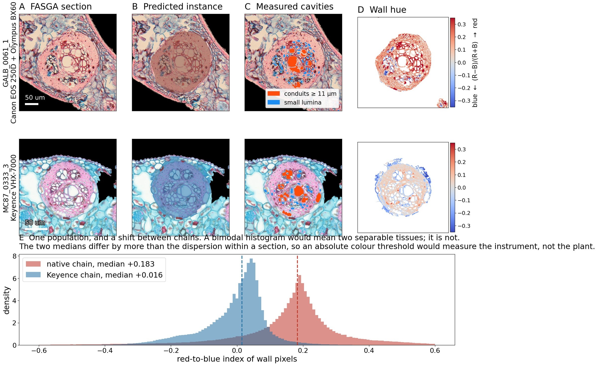
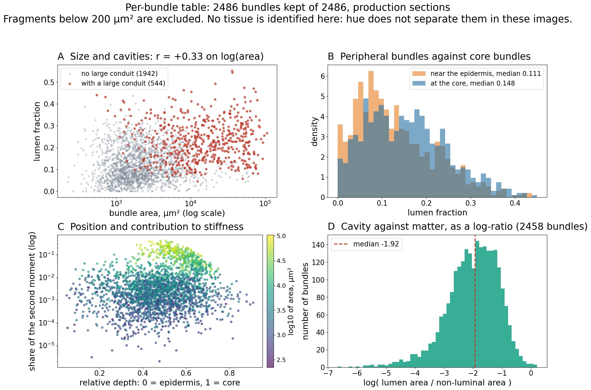

# Method notes

Why Faspy is built the way it is, with the measurements behind each choice.
The [README](../README.md) covers what the pipeline does and how to run it;
this page covers why.

---

### Two acquisition chains, two pixel sizes

127 of the annotated sections were prepared and imaged on a Canon EOS 250D
mounted on an Olympus BX60; the other 24 were prepared at the AMAP platform and
imaged on a Keyence VHX-7000. Their scale bars differ, and so must their
calibration:

| | pixel size |
|---|---|
| Canon / Olympus, 20× objective | 0.1853 µm |
| Keyence VHX-7000 | 0.1435 µm |

Applying the native value to the Keyence sections would overstate their lengths
by 29.2 % and their areas by 66.9 %. **Pixel size is therefore set per section**,
from an explicit list in the configuration rather than from a directory scan, so
that the calibration is right on any machine.

Nothing downstream catches this on its own: the manual ImageJ reference areas
are expressed in **pixels**, so the area check that agrees to 0.0 % tests the
masking chain and never the conversion factor.

### Cleaning the leaflet mask before any geometry

Mosaic stitching leaves thin panelling lines in the images. They are not black,
so they enter the leaflet mask, where they shift the bounds of each column and
therefore the midpoint between them. Their area is negligible; their effect on
the mid-plane is not.

A morphological opening of **3 µm**, defined in micrometres so that it means the
same thing on both chains, is applied before any geometric measurement. The size
was fixed by sweeping 3 to 10 µm against a blind visual reading of 50 sections:
3 µm is the smallest opening that reaches full effect. Keeping only the main
component is necessary but **not** sufficient — the noise is often connected to
the tissue. Across the 433 production sections the correction takes the number
with a curvature index below 1 from **63 to 0**.

The cleaned mask is used **only** for geometry. Areas, fractions and counts stay
on the original mask, so the correction cannot silently move a published area.

Above, panelling lines left by mosaic stitching pull the mid-plane out of
the leaflet entirely. Below, a section where nothing changes. A
`curvature_index` under 1 is not a geometric impossibility — the principal axis
minimises the second moment among *straight* lines, while the mid-plane is a
curve constrained to minimise nothing — but it is a reliable alarm that the
mid-plane is misplaced, and it is what led to this defect.

### Scale is the critical parameter

Cellpose-SAM was pretrained on object diameters of roughly 7.5 to 120 px. The
median annotated bundle is 321 px across at acquisition resolution and 161 px at
the working scale, so only 1 % and 26 % of objects respectively fall inside that
range. Reducing by a further factor of 0.35 brings the median to 56 px and 89 %
of objects into range.

The same factor is applied at training and at inference. Rescaling only at
inference moves the usable window instead of widening it: recall on the largest
quartile improves while recall on the smallest collapses.

---

### Colour does most of the work, but not all of it

The instance model is given the three channels of the stained image, and it is
the colour contrast between a bundle and the ground tissue that makes its
boundary recoverable at all. The leaflet mask is read from the summed channels,
the lumen rule from the minimum of the three. One further use was expected and
does not work: hue does **not** partition a bundle into conducting and
structural tissue.

The index is unimodal at every smoothing scale from none to 40 µm, so no
threshold is designated by the data. Its median also differs between the two
acquisition chains by more than the dispersion within a single section, so an
absolute threshold would report a difference in white balance as a difference in
tissue composition. A per-section threshold removes that bias but separates the
periphery of a bundle from its core rather than one tissue from another.
Measuring phloem area here would require manual reference annotation first.

The distinction is one of scale, not of principle: the stain separates a bundle
from the tissue around it well enough for a model to delineate it, and does not
separate tissues within the bundle well enough for a threshold to measure them.

### Beyond per-section totals

Aggregated tables cannot say whether large bundles are hydraulic or structural,
or whether peripheral bundles differ from central ones. A per-bundle table can.

---

## Design decisions

**Three classes, not five.** Vascular tissue is not separable by colour in FASGA
(IoU ≈ 0.08). Lumen was dropped as a learnt class — it only ever worked on the
DIC subset — and is measured photometrically instead.

**No hue jitter.** In FASGA the colour *is* the signal: red-magenta marks lignin,
blue marks cellulose. Only flips and right-angle rotations are used.

**No pretrained encoder.** An ImageNet-pretrained ResNet encoder regressed
(bundle IoU 0.67 → 0.57): the domain gap to stained microscopy outweighs the
transfer.

**Instance segmentation rather than semantic.** Pixel-wise labelling plateaued at
+119 % count error — it merges touching bundles and paints false patches in the
mesophyll that no area filter removes. That is a limit of the formulation.

**Minimum bundle area is fixed in pixels at acquisition resolution**
(`MIN_BUNDLE_AREA_FULLRES` = 6000), so the two chains retain slightly different
physical sizes: 206 µm² native against 124 µm² Keyence. The consequence was
measured at one component in 1126. `MIN_BUNDLE_AREA_PHYSICAL` switches to a
physical threshold; it is off by default so the code reproduces the published
measurements exactly.

**Duplicate sections are dropped when the manifest is built.** An earlier
converter appended `_v2` on a name collision instead of skipping, producing 24
byte-identical pairs that could put one twin in training and its twin in
validation. Every cross-validated figure produced before this was found is
optimistic and none is reported.

---

## Interpreting the metrics

Pixel IoU is reported but is not the criterion. For small objects with a diffuse
border it barely moves while counting and area move a great deal.

Three figures belong together. The mean **signed** area error is −4.5 %, so the
dataset total is very nearly right; the mean **absolute** error is 13.5 %, so a
single section is typically out by much more. What remains is spread between
sections, not a common offset — and applying the aggregate calibration factor of
1.121 *raises* the absolute error to 16.3 %, which is the clearest evidence of
it. The uncalibrated **13.5 %** is the figure to carry forward.

**The reference annotation limits the measured accuracy.** Of 1151 predictions,
50 overlapped no annotation by more than a quarter of their area; a plant
anatomist judged 45 of them genuine bundles the annotation had missed and 5
trichomes, leaving a false-detection rate of **0.4 %**. Part of the reported
count error is a property of the reference, not of the model.
`faspy diagnose orphans` re-runs that audit.

### Curvature is not a plant trait here

Decomposing the variance of the curvature index over the 148 admissible
sections, after the geometric correction, attributes 6.9 % to species and 1.0 %
to site; 93.1 % lies between sections of one species at one site.

The comparison with two other traits measured the same way on the same sections
is what makes this conclusive: species explains 31.7 % of the bundles' share of
the second moment and 37.2 % of leaflet thickness. The method separates species
perfectly well when there is something to separate. Curvature records how the
section came to rest on its slide.

Analyses should therefore rest on `I_bundle_share_flat`, measured about the
mid-plane, rather than `I_bundle_share`, measured about a straight axis that
absorbs the mounting.

---

### Curvature is not a plant trait here

Decomposing the variance of the curvature index over the 148 admissible
sections, after the geometric correction, attributes 6.9 % to species and 1.0 %
to site; 93.1 % lies between sections of one species at one site.

The comparison with two other traits measured the same way on the same sections
is what makes this conclusive: species explains 31.7 % of the bundles' share of
the second moment and 37.2 % of leaflet thickness. The method separates species
perfectly well when there is something to separate. Curvature records how the
section came to rest on its slide.

Analyses should therefore rest on `I_bundle_share_flat`, measured about the
mid-plane, rather than `I_bundle_share`, measured about a straight axis that
absorbs the mounting.

---
